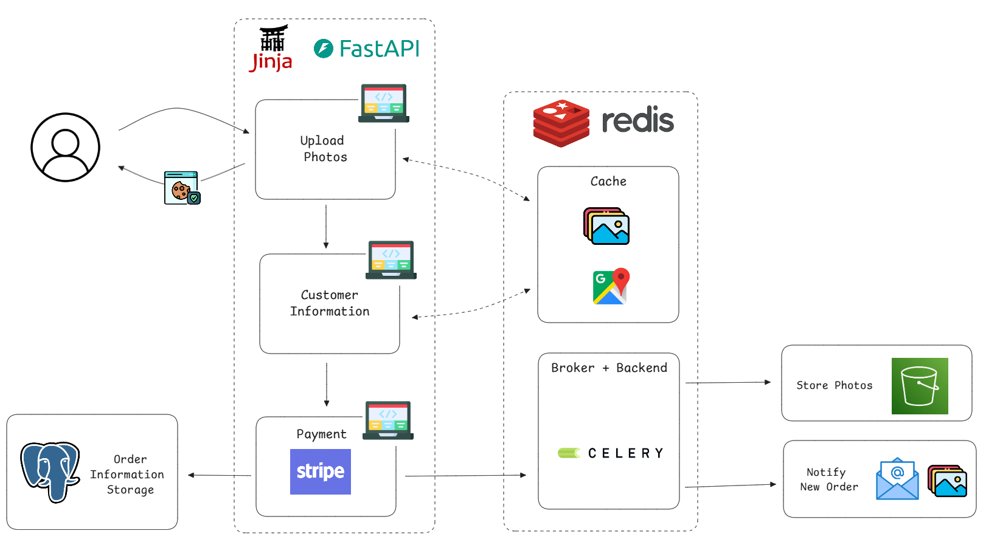

# Payment Gateway and Background Processing for Photo & Portrait Orders using Stripe, Celery, Redis, and FastAPI

This project handles a payment gateway and the processing of online portrait photos.

It receives customers' photos and caches them in Redis until payment is confirmed, at which point it processes the storage and owner notification in the background using Celery.

The idea behind this approach is to ensure that the photos are only stored after payment is confirmed and to process them in the background to avoid performance issues.

Below is a quick demonstration of how it works.


The project uses:

- [Jinja templates](https://jinja.palletsprojects.com/en/stable/) for frontend and email templates
- [FastAPI](https://fastapi.tiangolo.com/) for the backend and template rendering endpoints
- [Stripe](https://stripe.com/pt-pt) to process the payment gateway
- [Celery](https://docs.celeryq.dev/en/stable/index.html) to process tasks in the background
- Redis to cache values and also serve as the Celery broker and backend
- PostgreSQL to store all the order information
- Google API to perform address validation
- [Fastapi-mail](https://sabuhish.github.io/fastapi-mail/) to send emails
- [boto3](https://boto3.amazonaws.com/v1/documentation/api/latest/index.html) to store photos in AWS S3
- [pytest](https://docs.pytest.org/en/stable/), [pytest-cov](https://pytest-cov.readthedocs.io/en/latest/config.html), [testscontainers-python](https://testcontainers-python.readthedocs.io/en/latest/), and [pytest-mock](https://pytest-mock.readthedocs.io/en/latest/) to perform tests
- [Docker](https://www.docker.com/) to orchestrate all the services together

### How it works

The project was designed to avoid storing client data in the database before the payment is confirmed. This way, on the first page, when the user submits the uploaded photos and their respective quantities, the app stores the photos as Base64-encoded data in Redis. It then sends a session identifier as a cookie in the response, which will be used as the Redis key.

On the second page, the address is validated to ensure it corresponds to a single location and is exclusively in Portugal. Since the address is validated using the Google API, each search query sent for validation is cached to prevent multiple requests to the paid API with the same query.

Once the address is validated, the order details are stored in the database, and a Stripe Checkout session is generated. If the payment is confirmed, two background tasks are triggered using Celery: storage of the images in AWS S3 and sending an email to the host (business owner) with the order details.



All the values stored in Redis are set to expire after 1 day.

### How to run this project

This section shows how to run this project using Docker and locally.

For both methods, start with the two steps below:

1 - Clone the project:

```shell
git clone https://github.com/lealre/stripe-photo-gateway.git
```

2 - Access the repository:

```shell
cd stripe-photo-gateway
```

3 - Create the `.env` file

```shell
mv .env-example .env
```

The [`.env-example`](.env-example) file contains all the necessary environment variables. You need to set the Stripe API key and the price ID to be displayed, the AWS and Google API keys, and the email app password along with its configurations.

#### Using Docker

[How to install docker](https://docs.docker.com/get-started/get-docker/)

#### Local setup

This projects usses [uv](https://docs.astral.sh/uv/).

### Notes

- The project focused in the backend payment flow, and the edge cases where not tread, and can be done as futher steps
- templates are in async routes just due to the test coverage
